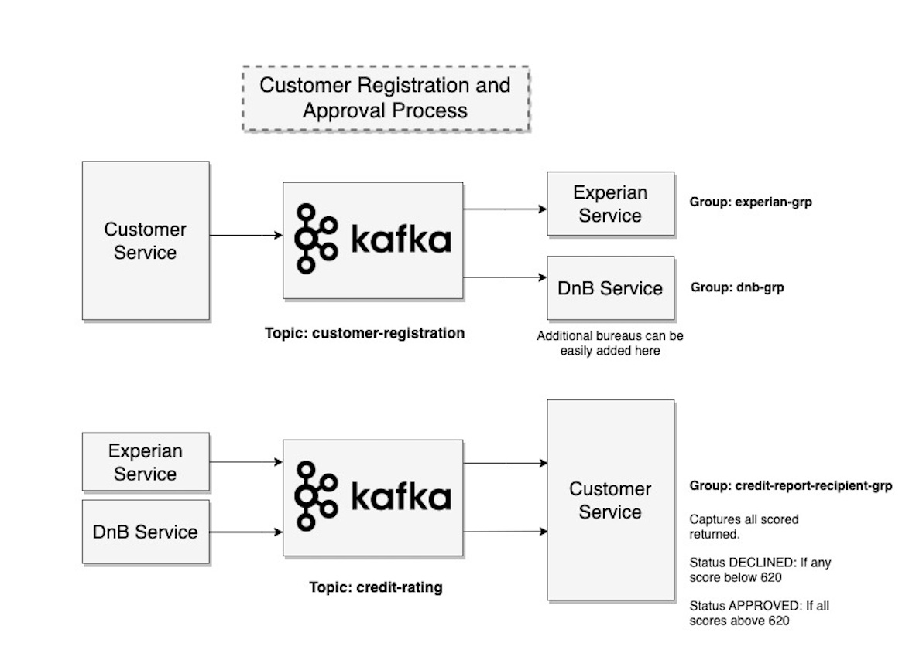

## Customer Registration and Approval Flow

An event driven approach to procure customer credit score from 
various credit bureaus and approve/decline the customer based on the
rating received. 

### Architecture Diagram

### Setup MongoDB

❯ docker pull mongo

❯ docker run -p27018:27017 --name kafka-mongo -d mongo

### Setup Zookeeper and Kafka Broker 
❯ docker-compose up -d 

### Start Customer Service
❯ cd customer-service

❯ mvn spring-boot:run

### Start DnB Service and Experian Service
Goto their respective directories and run

❯ mvn spring-boot:run

### Create Customer
Goto http://localhost:8080 and add customer using 
swagger ui.

